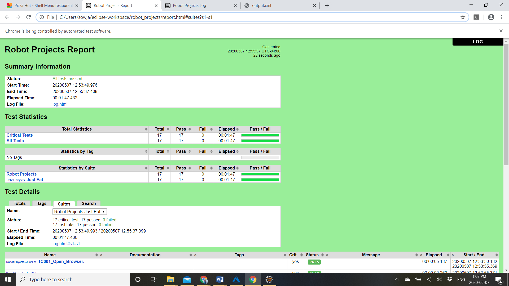
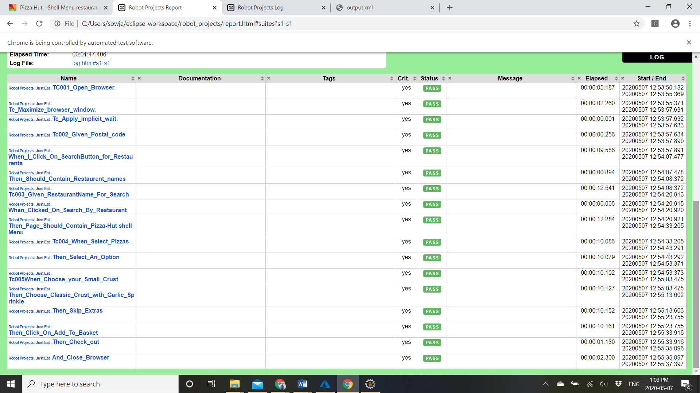
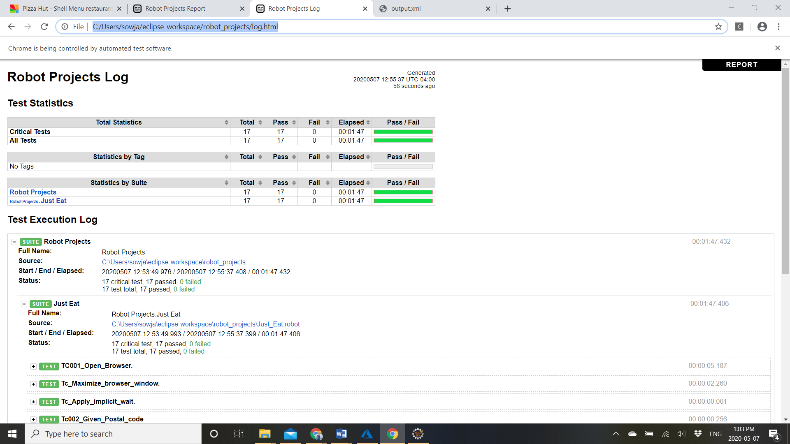
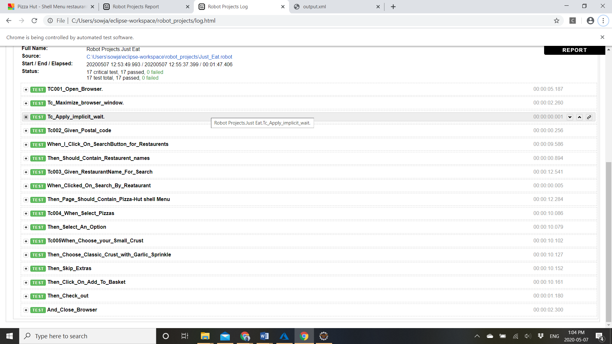
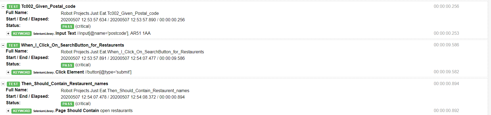
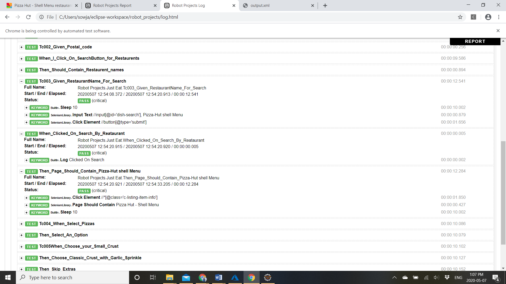
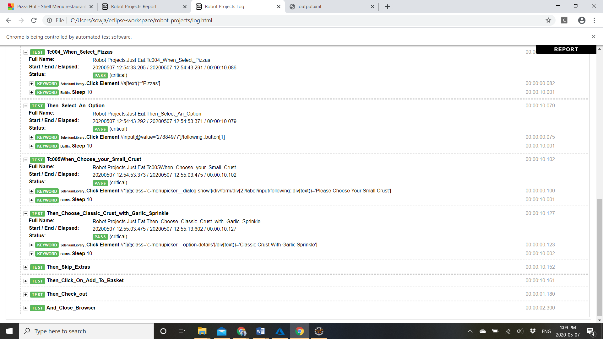
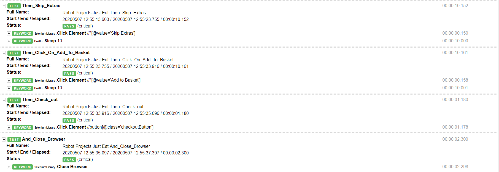
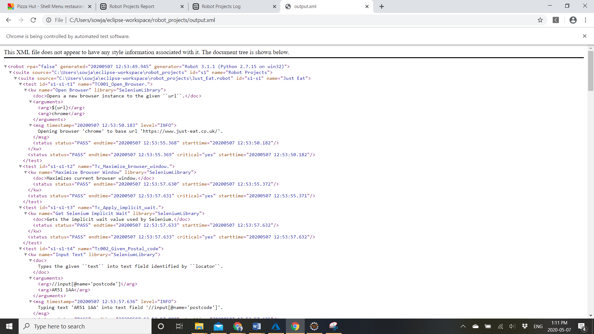

# QA-test
JUST EAT has a website available at http://www.just-eat.co.uk/  that you can use to find takeaway restaurants in a postcode area.		
The Technical test consists of 2 tasks:
1.	 Write the step definitions for the below scenario.
Feature: Use the website to find restaurants
•	So that I can order food
•	As a hungry customer
•	I want to be able to find restaurants in my area
Scenario: Search for restaurants in an area
•	Given I want food in "AR51 1AA"
•	When I search for restaurants
•	Then I should see some restaurants in "AR51 1AA"

2.	Add two more scenarios, with corresponding step definitions, which you feel would enhance the test coverage of the site.

#Here I used RobotFramework for that tool I Installed the following for the set up

- Install Python
- Install WX Python
- Install PyWin32
- Install Pip
- Pip install Robot Framework
- Pip install Docutils
- Pip install Xlrd
- Pip install Xlutils
- Pip install robotframework-excellibrary
- Pip install robotframework-selenium2library
- Pip install robotframework-seleniumlibrary
- Pip install robotframework-ride
- Pip install robotframework-pabot
- Check the pip list
- Install Eclipse
- Install RED-Robot Editor from Eclipse Market Place
- Then  your Robot Framework IDE will be ready in Eclipse
  - Open Robot Perspective
  - Navigate to Windows->Preferences
  - Select Robot Framework->Installed frameworks
  - Click on Apply and close
## Create a Robot Project
  - Select File->New->Robot Project
  -	Enter Project name and click Finish
  -	TestProj
  -	A new Robot project will be created along with its libraries
  -	Right click on the project and select New->Robot Test Suite
  -	Enter the Test Suite name and select format as .robot file and click Finish
  -	This will create new suite under the project
''' python 
*** Settings ***
Library    SeleniumLibrary
*** variables ***
${url}    https://www.just-eat.co.uk/
*** Test Cases ***
TC001_Open_Browser. 
    Open Browser    ${url}    chrome
Tc_Maximize_browser_window.
    Maximize Browser Window
Tc_Apply_implicit_wait.    
    Get Selenium Implicit Wait    
Tc002_Given_Postal_code
    Input Text    //input[@name='postcode']    AR51 1AA 
When_I_Click_On_SearchButton_for_Restaurents
    click Element    //button[@type='submit']
Then_Should_Contain_Restaurent_names
    Page should contain    open restaurants
    
Tc003_Given_RestaurantName_For_Search
    sleep    10
    Input Text     //input[@id='dish-search']    Pizza-Hut shell Menu
    Click Element    //button[@type='submit']
When_Clicked_On_Search_By_Reataurant
    Log    Clicked On Search 
Then_Page_Should_Contain_Pizza-Hut shell Menu
    Click Element    //*[@class='c-listing-item-info']
    Page Should Contain    Pizza Hut - Shell Menu
    sleep    10
Tc004_When_Select_Pizzas
    click Element    //a[text()='Pizzas']
    sleep    10
Then_Select_An_Option
    click Element    //input[@value='27884977']/following::button[1]
    sleep    10
Tc005When_Choose_your_Small_Crust
    click Element    //*[@class='c-menupicker__dialog show']/div/form/div[2]/label/input/following::div[text()='Please Choose Your Small Crust']
    sleep    10
Then_Choose_Classic_Crust_with_Garlic_Sprinkle
    click Element    //*[@class='c-menupicker__option-details']/div[text()='Classic Crust With Garlic Sprinkle']
    sleep    10
Then_Skip_Extras
    click Element    //*[@value='Skip Extras']
    sleep    10
Then_Click_On_Add_To_Basket
    click Element    //*[@value='Add to Basket']
    sleep    10
Then_Check_out
    click Element    //button[@class='checkoutButton']
And_Close_Browser
    close Browser    
When I execute this code I will get three reports
###First Report:
file:///C:/Users/sowja/eclipse-workspace/robot_projects/report.html

 
 
###Second Report: file:///C:/Users/sowja/eclipse-workspace/robot_projects/log.html

 
 
 
 
###This is the Scenario1:

 

###This is Scenario 2:

 
###Scenario 3:

 

###Scenario 4: 

 
###Third Report:

file:///C:/Users/sowja/eclipse-workspace/robot_projects/output.xml

 

